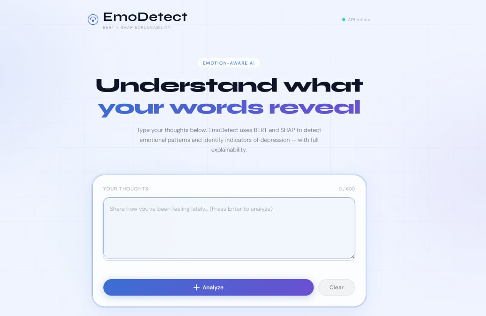
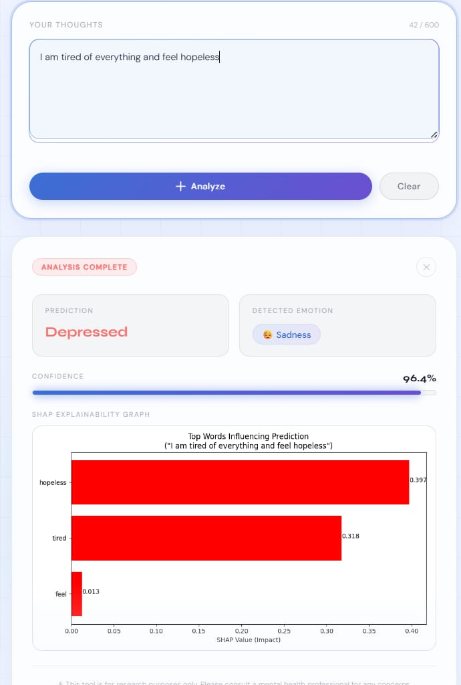
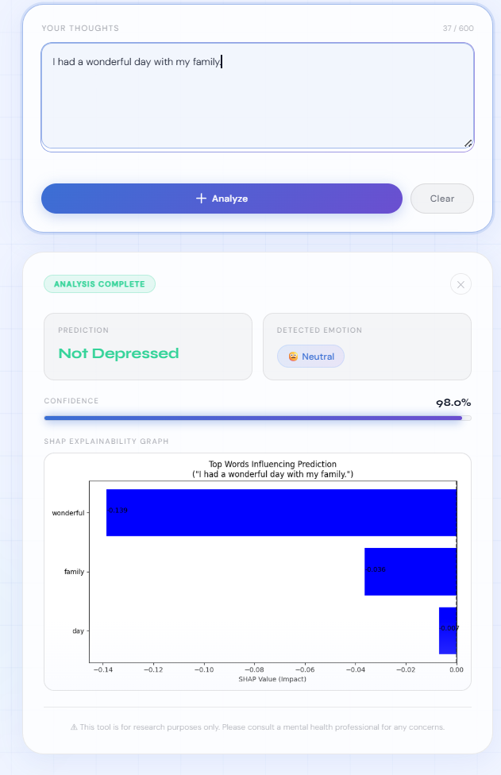

<div align="center">

# 🧠 EmoDetect: Depression Detection System

### An AI-powered NLP web app for detecting depression indicators from text — with full explainability

[](https://harshadadesale22.github.io/EmoDetect-Depression-Detection-System/Frontend/index.html)
[](https://huggingface.co/spaces/harshadadesale22/EmoDetect)
[]()
[]()

</div>

---

## 🚀 Live Demo

👉 **[Try EmoDetect Live](https://harshadadesale22.github.io/EmoDetect-Depression-Detection-System/Frontend/index.html)**

---

## 📖 Overview

EmoDetect is an AI-powered depression detection system developed using **DistilBERT**, **Flask**, and **HTML/CSS/JavaScript**. The application analyzes textual input to classify it as **Depressed** or **Not Depressed**, along with a confidence score and a SHAP-based explainability graph that highlights the words influencing the prediction.

---

## ✨ Features

| Feature | Description |
|---|---|
| 🧠 Depression Detection | Text classification powered by a fine-tuned DistilBERT model |
| 📊 SHAP Explainability | Visual breakdown of which words influenced the prediction |
| 📈 Confidence Score | Probability score for every prediction |
| 😊 Emotion Detection | Identifies the dominant emotion in the input text |
| ⚡ Real-time Prediction | Instant analysis through a REST API |
| 🌐 User-friendly Interface | Clean, responsive web UI |
| 🔥 Flask REST API | Lightweight backend serving the model |
| 📱 Responsive Design | Works smoothly across devices |

---

## 🛠️ Tech Stack

**Frontend**


**Backend**


**Machine Learning**


---

## 📂 Project Structure

```text
EmoDetect-Depression-Detection-System
│
├── Backend
│   ├── app.py
│   ├── requirements.txt
│   └── static/
│
├── Frontend
│   ├── index.html
│   ├── script.js
│   └── style.css
│
├── screenshots
│   ├── home-page.png
│   ├── depression-prediction.png
│   └── not-depressed-prediction.png
│
├── .gitignore
├── README.md
└── report.pdf
```

---

## 📸 Screenshots

<div align="center">

### 🏠 Home Page


### 📉 Depression Prediction


### 😊 Not Depressed Prediction


</div>

---

## ⚙️ Installation

> 💡 Want to try it without installing anything? Use the [Live Demo](https://harshadadesale22.github.io/EmoDetect-Depression-Detection-System/Frontend/index.html) above.

**Clone the repository**
```bash
git clone https://github.com/harshadadesale22/EmoDetect-Depression-Detection-System.git
```

**Backend Setup**
```bash
cd Backend
pip install -r requirements.txt
python app.py
```

**Frontend Setup**
Open the `Frontend` folder and launch `index.html` using a local web server (e.g. VS Code Live Server) or any static file server.

---

## 🔄 Workflow

1. User enters text into the web interface.
2. The frontend sends the input to the Flask backend (hosted on Hugging Face Spaces).
3. DistilBERT processes the text.
4. The model predicts whether the text indicates **Depressed** or **Not Depressed**.
5. SHAP generates an explainability graph showing the most influential words.
6. The prediction, confidence score, detected emotion, and SHAP visualization are displayed.

---

## 📊 Output

The application provides:
* Depression Prediction
* Detected Emotion
* Confidence Score
* SHAP Explainability Graph
* Important Influential Words

---

## 🔮 Future Enhancements

* User Authentication
* Prediction History
* Multi-language Support
* Expanded Emotion Classification
* Cloud Deployment Improvements
* Mobile Application

---

## 👥 Project Team

* Harshada Desale
* Nayan Khalane
* Darshana Khairnar
* Raj Jadhav

---

## 🎓 Academic Information

| | |
|---|---|
| **Degree** | Master of Computer Applications (MCA) |
| **Institute** | SVKM's Institute of Technology, Dhule |
| **Academic Year** | 2025–2026 |
| **Project Guide** | Prof. Madhuri Patil |

---

## 📄 License

This project was developed for academic and educational purposes.

---

<div align="center">

⚠️ This tool is for research and educational purposes only. Please consult a mental health professional for any concerns.

</div>
